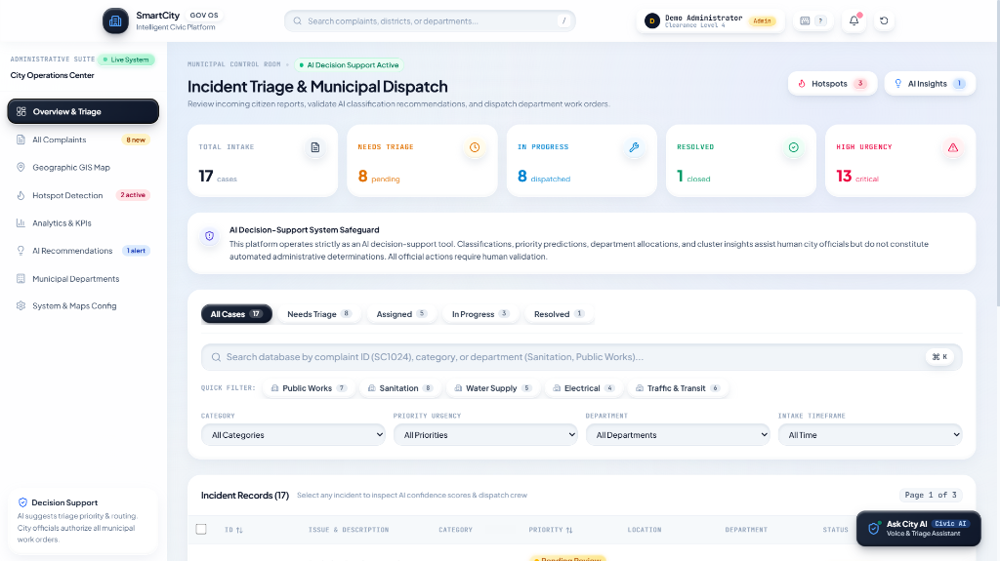
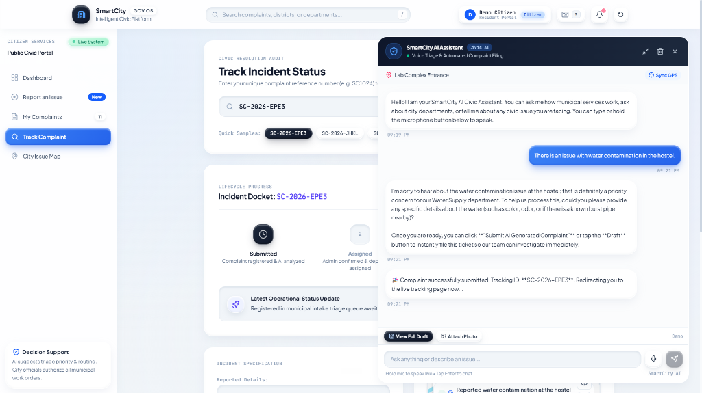
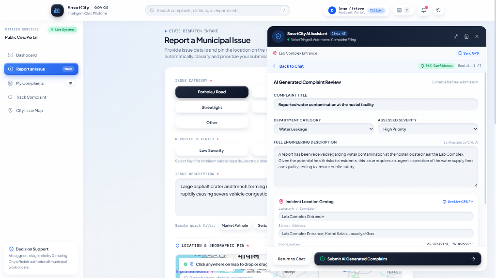
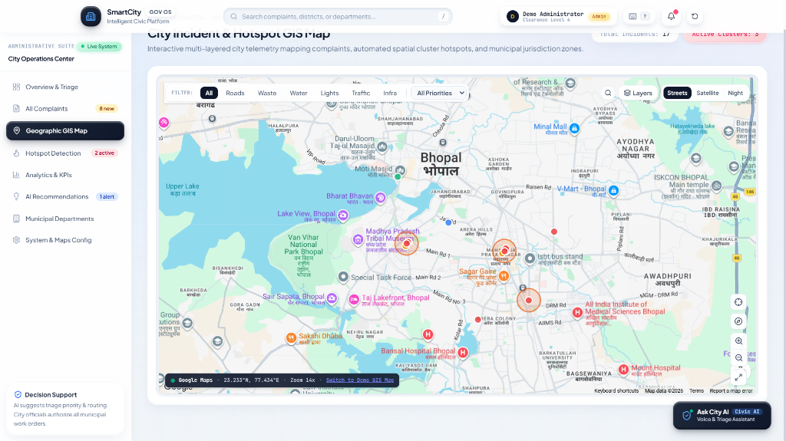
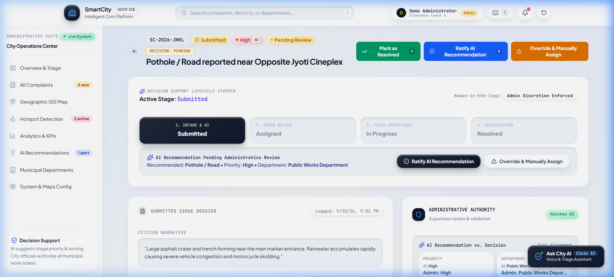
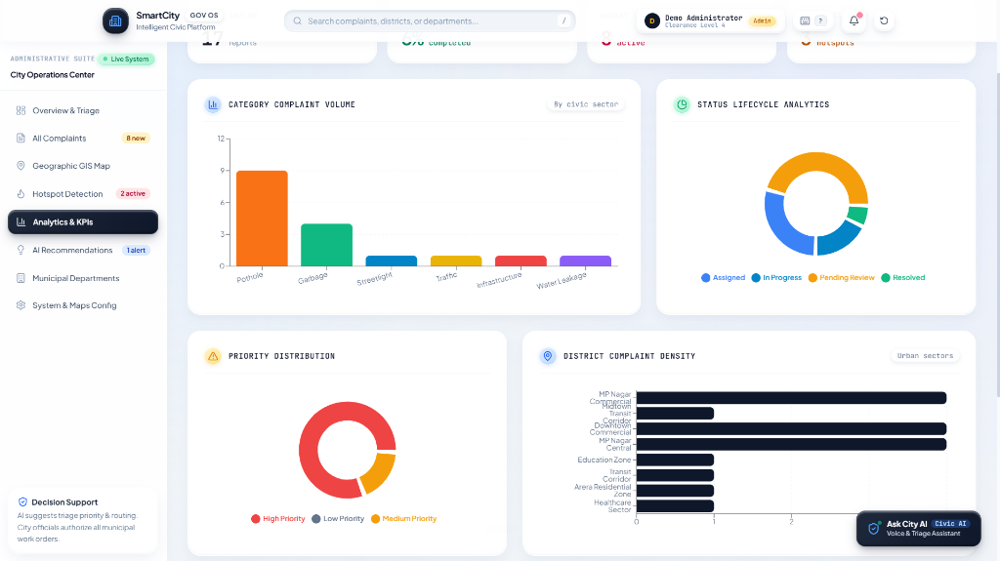

<!-- _class: lead -->
<!-- _backgroundColor: #070B14 -->

# 🏙️ SmartCity GOV OS
### Intelligent Civic Operations & Autonomous Municipal Triage Platform

  Live on Vercel
  Google Gemini 2.5 AI
  React 19 & TypeScript
  DBSCAN GIS Clustering
  Human-in-the-Loop

**Bridging Urban Residents & Municipal Administration with Multimodal AI, Spatial Telemetry, and Verifiable Governance.**

 

Production Deployment: https://ai-based-city-management-system-dar.vercel.app

---

## 🏛️ The Urban Governance Dilemma

  

    
📉

    <h3 style="color: #FB7185;">Citizen Reporting Friction</h3>
    

      Legacy municipal portals force lengthy forms with bureaucratic jargon, resulting in severe citizen reporting fatigue and silent infrastructure decay.
    

  

  

    
⏳

    <h3 style="color: #FBBF24;">Control Room Bottlenecks</h3>
    

      Municipal supervisors spend 65%+ of their time manually reading, deduplicating, and routing incoming reports across disconnected department silos.
    

  

  

    
🔥

    <h3 style="color: #38BDF8;">Reactive Maintenance Trap</h3>
    

      Cities deploy costly emergency repairs only after roads cave in or mains rupture, missing the preventive cluster patterns hidden in daily complaints.
    

  

 

  <strong style="color: #38BDF8;">The SmartCity Paradigm:</strong> An autonomous, proactive operating system uniting natural language voice triage with geospatial machine learning and sovereign human oversight.

---

## ⚡ Dual-Portal Architecture

  

    Citizen Experience
    <h2 style="font-size: 22px; margin-top: 8px;">Public Resident Portal</h2>
    <ul style="font-size: 15px; padding-left: 18px; margin-top: 10px;">
      <li><strong>"Ask City AI" Assistant:</strong> Conversational voice-to-text intake.</li>
      <li><strong>Interactive GIS Pinpoint:</strong> Reverse geocoding & landmark snapping.</li>
      <li><strong>Instant Tracking Dossier:</strong> Collision-safe unique reference ID.</li>
      <li><strong>Live Timeline & Feedback:</strong> Stepwise resolution tracking with citizen ratings.</li>
      <li><strong>Privacy by Design:</strong> Zero public exposure of citizen contact details.</li>
    </ul>
  

  

    Administrative Authority
    <h2 style="font-size: 22px; margin-top: 8px;">City Operations Center</h2>
    <ul style="font-size: 15px; padding-left: 18px; margin-top: 10px;">
      <li><strong>Incident Triage Queue:</strong> Live case intake & urgency triage scoring.</li>
      <li><strong>GIS Hotspot Intelligence:</strong> Multi-layer spatial density telemetry.</li>
      <li><strong>Departmental Routing:</strong> Targeted dispatch to PWD, Water, Sanitation, Traffic.</li>
      <li><strong>HITL Decision Ratification:</strong> One-click approval or manual reassignment.</li>
      <li><strong>Executive KPI Visualizations:</strong> Category volume & lifecycle velocities.</li>
    </ul>
  

---

## 🎛️ Operations Command Deck & Triage

  

    <h3 style="color: #38BDF8;">Centralized City Operations Center</h3>
    

      City administrators gain a single pane of glass into municipal activity across all sectors and districts.
    

    <ul style="font-size: 15px; padding-left: 18px;">
      <li><strong>Real-time Telemetry:</strong> Instant case counts (Total Intake, Needs Triage, Dispatched, Resolved).</li>
      <li><strong>Urgency Filtering:</strong> High-priority flag alerts for critical safety hazards.</li>
      <li><strong>Departmental Triage:</strong> Filter by Public Works, Sanitation, Water Supply, Electrical, and Transit.</li>
      <li><strong>Audit Trail Guardrails:</strong> Transparent tracking with supervisor accountability.</li>
    </ul>
  

  

    
  

---

## 🎙️ "Ask City AI" Conversational Voice Triage

  

    
  

  

    Natural Language Intake
    <h2 style="font-size: 22px; margin-top: 8px;">No Forms. Just Speak.</h2>
    

      Powered by Google Gemini 2.5 AI and the Web Speech API, residents report issues in natural conversational language.
    

    <ul style="font-size: 15px; padding-left: 18px;">
      <li><strong>Hands-Free Speech Recognition:</strong> Voice input with instant transcription.</li>
      <li><strong>Autonomous Entity Extraction:</strong> Extracts incident type, location cues, and severity.</li>
      <li><strong>Dynamic Conversational Prompts:</strong> Asks intelligent clarifying questions if details are missing.</li>
      <li><strong>Live Ticket Synthesis:</strong> Compiles an official complaint ticket ready for confirmation.</li>
    </ul>
  

---

## 📋 Automated Engineering Synthesis

  

    AI Pre-Submission Review
    <h2 style="font-size: 22px; margin-top: 8px;">Citizen Pre-Submission Validation</h2>
    

      Before entering the municipal registry, the AI synthesizes an engineering-grade report and displays it for resident verification.
    

    <ul style="font-size: 15px; padding-left: 18px;">
      <li><strong>Department Jurisdiction Match:</strong> Routes accurately to responsible agency.</li>
      <li><strong>Assessed Severity Classification:</strong> Categorized with clear reasoning.</li>
      <li><strong>Reverse-Geocoded Landmark:</strong> Snaps coordinates to official city addresses.</li>
      <li><strong>Citizen Transparency:</strong> Residents can review and edit every parameter before dispatch.</li>
    </ul>
  

  

    
  

---

## 🗺️ GIS Telemetry & Spatial Hotspot Map

  

    
  

  

    Geospatial Intelligence
    <h2 style="font-size: 22px; margin-top: 8px;">Multi-Layered Spatial Mapping</h2>
    

      Seamless hybrid mapping utilizing Leaflet OSM and Google Maps Platform to pinpoint and track urban friction.
    

    <ul style="font-size: 15px; padding-left: 18px;">
      <li><strong>Dynamic Marker Pulses:</strong> High-urgency active incidents pulse in real time.</li>
      <li><strong>Automated Cluster Detection:</strong> Computes spatial density hotspots using Haversine distance matrices.</li>
      <li><strong>Sensitive Zone Awareness:</strong> Automatically detects proximity to hospitals, schools, and transit gates.</li>
      <li><strong>Multi-Layer Filtering:</strong> Toggle road hazards, waste heaps, water leaks, and light fixtures.</li>
    </ul>
  

---

## 🛡️ Human-in-the-Loop (HITL) AI Decision Support

  

    Responsible AI
    <h2 style="font-size: 22px; margin-top: 8px;">AI Recommends. Humans Authorize.</h2>
    

      SmartCity strictly enforces an advisory model: AI produces transparent recommendation dossiers, while certified municipal supervisors make final dispatch decisions.
    

    <ul style="font-size: 15px; padding-left: 18px;">
      <li><strong>AI Confidence Score:</strong> Explicit statistical certainty for priority & department.</li>
      <li><strong>Urgency Reasoning Factors:</strong> Enumerates why an issue requires immediate attention.</li>
      <li><strong>One-Click Ratification:</strong> Endorse AI recommendation in one second.</li>
      <li><strong>Auditable Override:</strong> Reassign priority or department with mandatory rationale.</li>
      <li><strong>Strict State Machine:</strong> Prevents illegal skips (e.g. submitted ➔ resolved).</li>
    </ul>
  

  

    
  

---

## 📊 Real-Time Analytics & Municipal KPIs

  

    
  

  

    Executive Intelligence
    <h2 style="font-size: 22px; margin-top: 8px;">Data-Driven City Management</h2>
    

      Comprehensive analytics provide urban planners and department directors with actionable operational visibility.
    

    <ul style="font-size: 15px; padding-left: 18px;">
      <li><strong>Category Complaint Volume:</strong> Identifies sectors with escalating infrastructure demand.</li>
      <li><strong>Status Lifecycle Distribution:</strong> Visualizes operational bottlenecks across triage stages.</li>
      <li><strong>Priority Ratio Donuts:</strong> Tracks proportion of high vs low hazard tickets.</li>
      <li><strong>District Density Heatmaps:</strong> Reveals urban sectors with highest civic friction.</li>
    </ul>
  

---

## 🔒 Enterprise Security & Public Privacy

  

    
🔐

    <h3 style="color: #38BDF8;">Cryptographic RBAC</h3>
    

      Citizen and Administrator roles are isolated via cryptographic tokens. Unauthorized attempts to access administrative triage endpoints return strict <code>403 FORBIDDEN</code>.
    

  

  

    
🛡️

    <h3 style="color: #34D399;">PII Redaction Engine</h3>
    

      Public APIs automatically scrub citizen phone numbers, full names, and exact residential coordinates before publishing public incident feeds.
    

  

  

    
⚡

    <h3 style="color: #FB7185;">Prompt Injection Defense</h3>
    

      All citizen voice and text narratives are strictly quarantined within untrusted delimiter wrappers before model inference, preventing instruction hijacking.
    

  

 

  <strong style="color: #34D399;">Verified Reliability:</strong> Tested against 43 automated architectural, security, and lifecycle verification assertions with 100% pass rate.

---

## 🛠️ Full-Stack Technology Stack

  

    <h3 style="color: #38BDF8;">Frontend Architecture</h3>
    <ul style="font-size: 14px; padding-left: 18px; margin-top: 8px;">
      <li><strong>React 19 & TypeScript:</strong> Modern component hierarchy.</li>
      <li><strong>Tailwind CSS v4 & Claymorphism:</strong> Premium UI tokens.</li>
      <li><strong>Motion (Framer Motion):</strong> Fluid layout animations.</li>
      <li><strong>Recharts & Leaflet / Google Maps:</strong> Rich data telemetry.</li>
      <li><strong>Web Speech API:</strong> Native browser voice capture.</li>
    </ul>
  

  

    <h3 style="color: #34D399;">Backend & AI Engine</h3>
    <ul style="font-size: 14px; padding-left: 18px; margin-top: 8px;">
      <li><strong>Google Gemini 2.5 Flash / Pro:</strong> Autonomous triage.</li>
      <li><strong>Node.js & Express:</strong> Authoritative REST API backend.</li>
      <li><strong>Firebase Cloud Firestore:</strong> Enterprise persistent store.</li>
      <li><strong>Zod Schemas:</strong> Strict runtime type validation.</li>
      <li><strong>Dual Bundling (esbuild):</strong> CJS & ESM serverless output.</li>
    </ul>
  

---

<!-- _class: lead -->
<!-- _backgroundColor: #070B14 -->

# Transforming Cities from Reactive to Autonomous

  70%
  Faster Intake Triage

  45%
  Faster Resolution Velocity

  100%
  Human-in-the-Loop Oversight

 

### Experience the Future of Municipal Operations

🌐 **Live System:** [ai-based-city-management-system-dar.vercel.app](https://ai-based-city-management-system-dar.vercel.app)  
💻 **Source Code:** [github.com/Darshil1532/AI-based-city-management-system](https://github.com/Darshil1532/AI-based-city-management-system)

 

SmartCity GOV OS • Intelligent Civic Operations Platform

